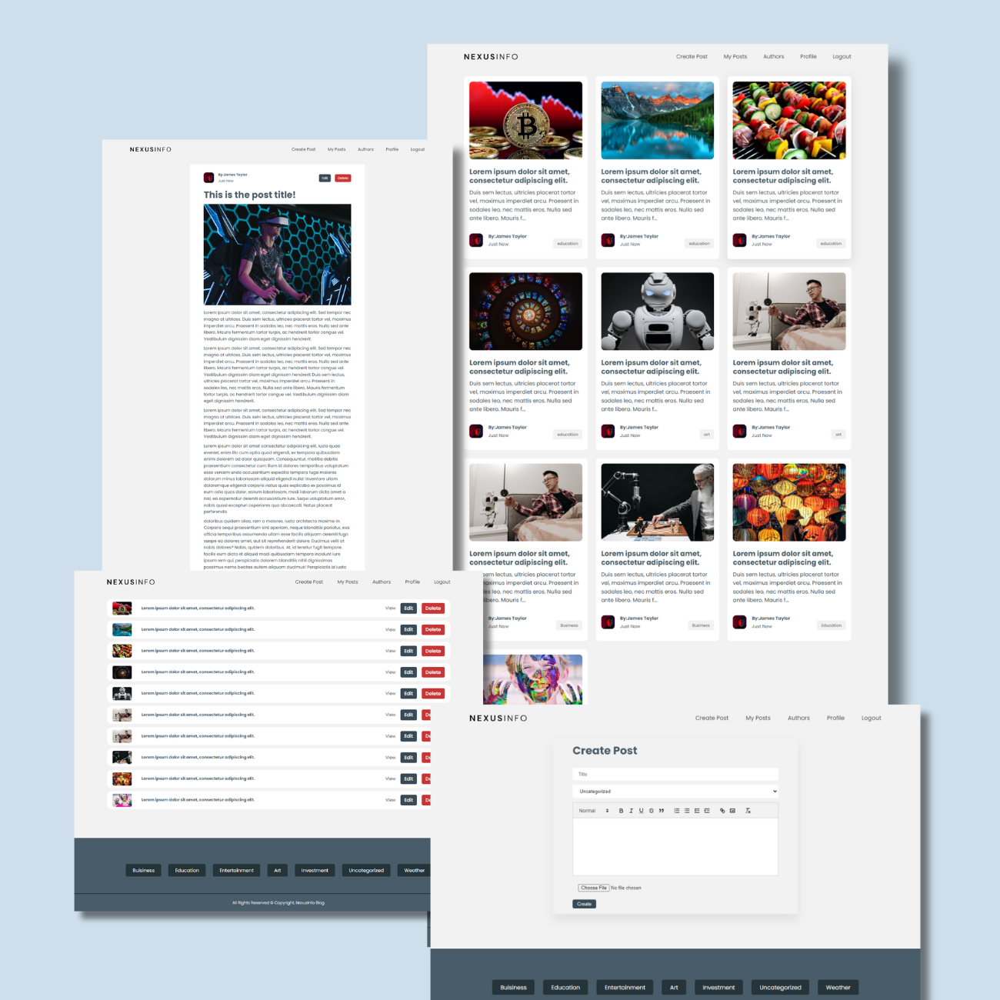

# NexusInfo - Blog App 

NexusInfo-BlogApp is a React JS website developed for users to create, share, and manage their own blogs effortlessly. Built with modern web technologies, this application provides a user-friendly interface for both bloggers and readers alike. The application also includes functionality to save blog posts locally using localStorage, ensuring that users can access their drafts even when offline.

## Screenshots

